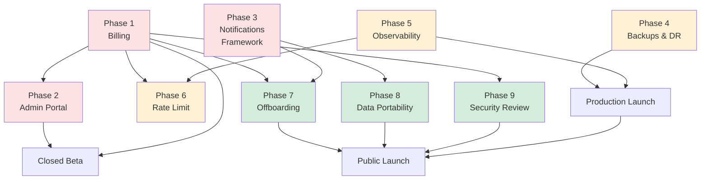
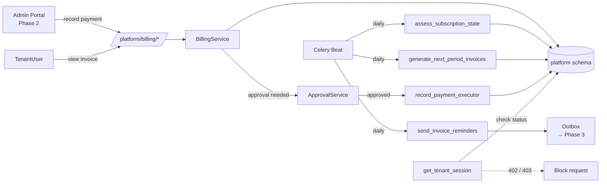
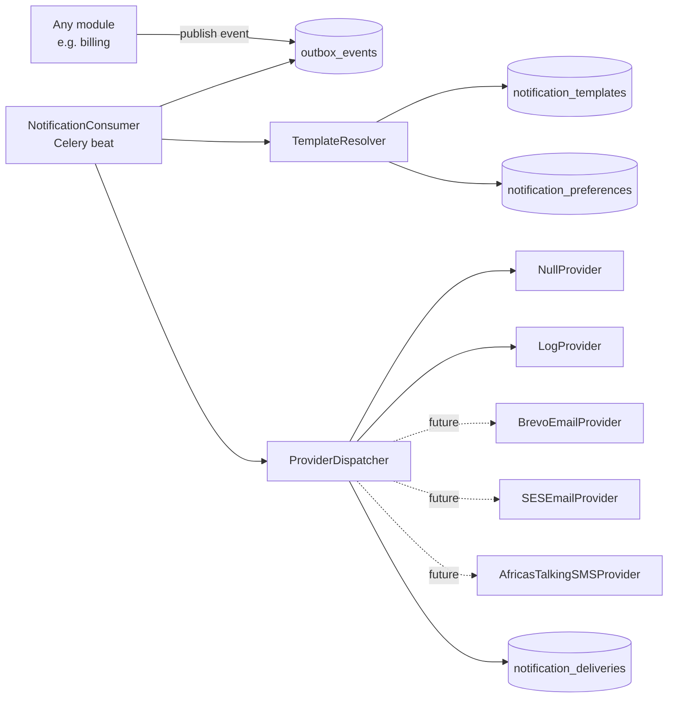
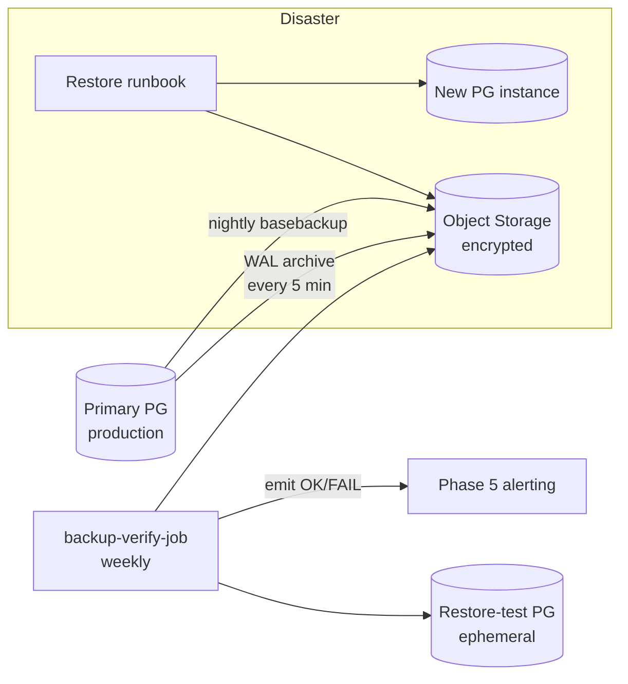
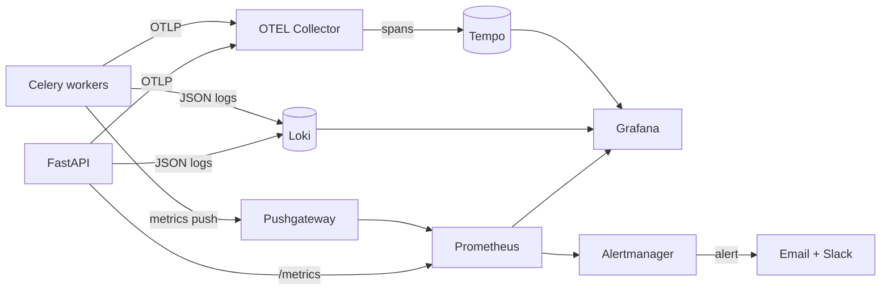
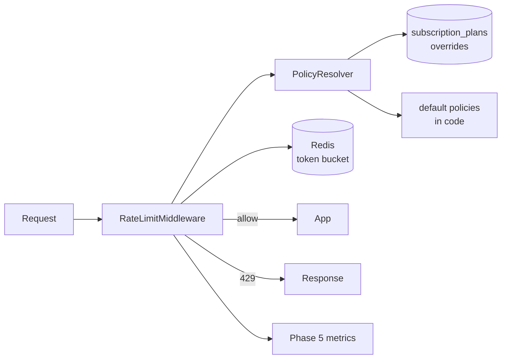
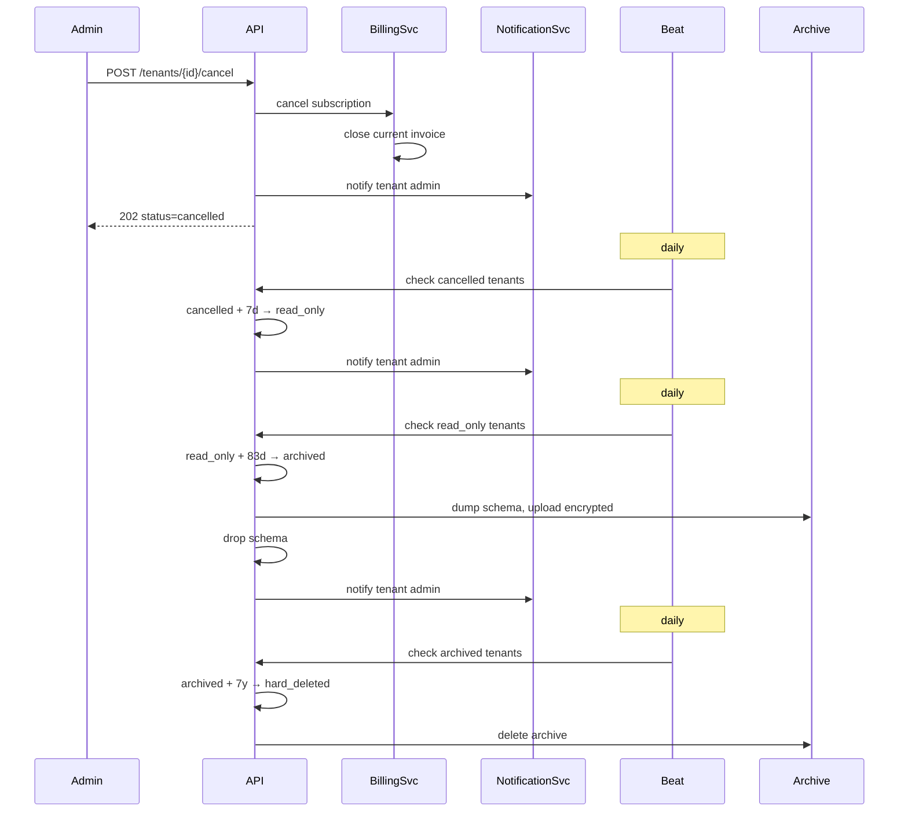
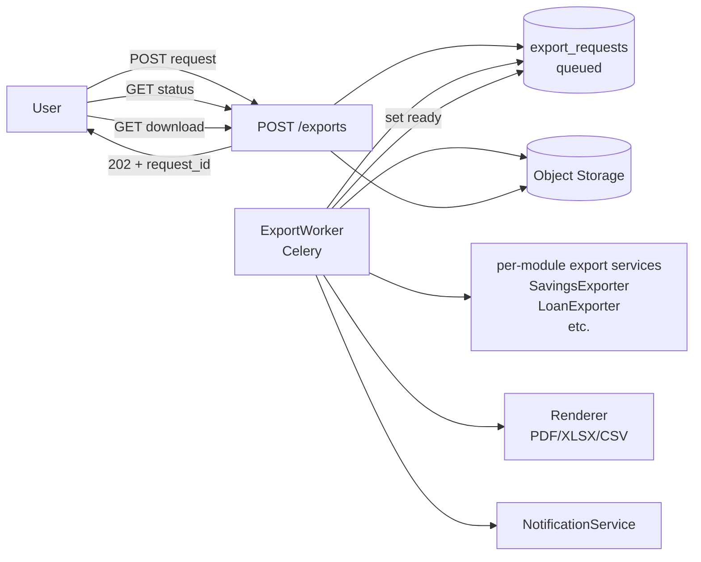
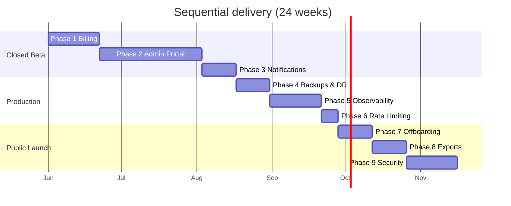
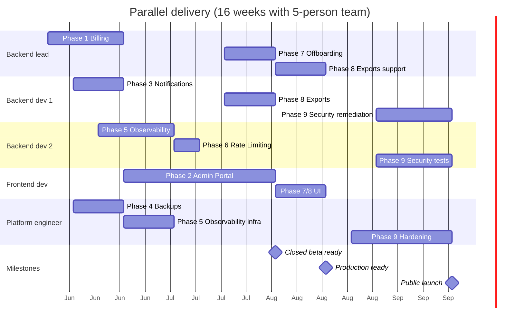

# SACCO SaaS Platform — Master Launch Roadmap

> **Status:** Drafted 2026-05-31. Authoritative roadmap for everything between
> "all 10 bounded contexts shipped" (HEAD `b251126`) and commercial launch.
>
> **Scope:** Nine phases, sequenced by the operational dependency graph.
> Phases 1–3 unblock closed beta. Phases 4–6 unblock production. Phases 7–9
> unblock public launch.
>
> **How to use this:** Each phase section below is self-contained enough to
> open a fresh Claude Code session, point it at this file, and have it
> implement that phase. The phase headers map to module folders under
> `app/platform_/` and `app/modules/`.

---

## 1. Executive Summary

The platform at HEAD has all ten bounded contexts shipped (core, platform_,
iam, ledger, members, shares, savings, fees, credit, reporting), 594 passing
tests, ruff/mypy clean, every tenant-scoped route requires
`CurrentTenantUser`, and the dev environment + Makefile are operable. What's
missing before money can move through it commercially is **operational
infrastructure** — billing, an admin UI, notifications, backups,
observability, rate limiting, offboarding, member-data portability, and an
external security review.

Those nine concerns are sequenced this way and not another because:

- **Billing first.** Without it, every other phase is doing free work for
  customers who haven't agreed to pay anything. It also defines the data
  model (`subscription_status` on `platform.tenants`) that the access
  middleware in later phases keys off of.
- **Admin portal second.** No human SACCO operator will `curl` the API. The
  back-office UI is the bottleneck on every operational workflow downstream
  (recording offline payments, approving maker-checker requests, reading
  audit logs).
- **Notifications framework third, providers later.** The framework
  (templates, events, history, provider interface) unblocks downstream
  modules that depend on "notify the user" semantically, but the actual
  email/SMS delivery is non-blocking for closed beta and can ship via
  `NullNotificationProvider` initially.
- **Backups, observability, rate limiting** must land before any real money
  flows through the platform. None of them gate development; they all gate
  production.
- **Offboarding, data portability, security review** are public-launch
  blockers but can be deferred past closed beta.

Sequential timeline: **24 calendar weeks (~6 months)** with one tech lead +
two backend + one frontend + one platform engineer. With parallel teams as
described in §7, it compresses to **16 weeks (~4 months)**.

The two highest-risk items are Phase 2 (admin portal — largest single
deliverable) and Phase 9 (external security assessment — depends on a
third-party vendor's calendar). Everything else is calibrated 1–3 weeks.

---

## 2. Recommended Architecture Strategy

The platform stays a **modular monolith**. None of the nine phases below
warrant a microservice split. Cross-cutting decisions:

### 2.1 Where each phase's code lives

| Phase | Module path | Conventions |
|---|---|---|
| 1 Billing | `app/platform_/billing/` | Platform-level concern, mirrors `app/platform_/tenants/` |
| 2 Admin Portal | `admin/` (new Next.js workspace) + `app/platform_/admin/` (API support only if needed) | Frontend lives separately; talks to existing APIs |
| 3 Notifications | `app/core/notifications/` | Cross-cutting infrastructure, used by every module |
| 4 Backups & DR | `infra/backups/` + runbooks in `docs/runbooks/` | Mostly infra + scripts, not application code |
| 5 Observability | `app/core/observability/` + `infra/observability/` | Library code in `app/`, dashboards/alerts in `infra/` |
| 6 Rate Limiting | `app/core/rate_limit/` | Middleware + Redis state |
| 7 Offboarding | `app/platform_/billing/` (mostly) + `app/platform_/tenants/` (lifecycle) | Extends the lifecycle from Phase 1 |
| 8 Data Portability | `app/platform_/exports/` + per-module export services | New cross-cutting export module |
| 9 Security | Cross-cutting; doc-heavy | `docs/security/`, plus targeted code hardening |

### 2.2 Where subscription state lives

`subscription_status` is on `platform.tenants` (an enum: `pending`,
`trialing`, `active`, `past_due`, `suspended`, `cancelled`). The current
`is_active` boolean stays as a hard kill-switch (set by an operator); the
new `subscription_status` is the soft state driven by Phase 1 jobs.
`get_tenant_session` gains a `verify_subscription_state()` step that
returns 402 Payment Required for `past_due` outside grace and 403 for
`suspended`/`cancelled`.

### 2.3 Sync vs async boundaries

- **Synchronous** in the request: subscription state check, rate limit
  check, audit log write.
- **Asynchronous via outbox**: notification events (Phase 3), export
  generation (Phase 8), all third-party processor webhook handoffs (when
  Flutterwave/Stripe land post-launch).
- **Background via Celery beat**: subscription state transitions, invoice
  generation, backup verification, rate-limit counter reset.

### 2.4 Payment processor abstraction

Even though Phase 1 ships offline-only, the `PaymentProcessor` interface
is defined upfront. The offline flow is just `OfflineProcessor`. Future
work (post-launch) plugs in `FlutterwaveProcessor`, `StripeProcessor`,
`MobileMoneyProcessor` without touching the billing service.

### 2.5 Tenant data model contracts (do not violate)

- Subscription state is **platform-scoped** — lives in `platform.*` tables
  only. Tenant schemas never know what plan they're on; they only see
  request-level access decisions made by middleware.
- Notifications, invoices, exports are **created by the platform** but
  may target tenant users — when they do, the row lives in
  `platform.notification_events` (etc.) with a tenant_id FK, not in the
  tenant schema.
- Audit log writes from billing/admin actions go to
  `platform.audit_log` (already implemented).

---

## 3. Complete Roadmap (one-page view)

| Phase | Title | Effort | Blocks | Blocked by |
|---|---|---|---|---|
| 1 | Billing & Subscription Management | L (3 wk) | 2, 6, 7 | — |
| 2 | Admin / Back-Office Portal | XL (6 wk) | beta launch | 1 (for billing screens) |
| 3 | Notifications Framework (no real providers) | M (2 wk) | 7, 8 (notify on completion) | — |
| 4 | Backups & Disaster Recovery | M (2 wk) | prod launch | — |
| 5 | Observability & Monitoring | L (3 wk) | prod launch | — |
| 6 | Rate Limiting & Abuse Protection | S (1 wk) | prod launch | 5 (for metrics) |
| 7 | Tenant Offboarding & Retention | M (2 wk) | public launch | 1, 3 |
| 8 | Data Portability & Member Exports | M (2 wk) | public launch | 3 |
| 9 | External Security Assessment & Hardening | L (3 wk) | public launch | 1, 2, 4, 6 |

Sequential total: **24 weeks**. Parallel total (see §7 staffing): **16 weeks**.

---

## 4. Dependency Graph



**Reading the diagram:** red = closed-beta blockers, yellow = production
blockers, green = public-launch blockers. Anything that does not point at
the gate node above it can ship in parallel.

---

## 5. Phase-by-Phase Breakdown

### Phase 1 — Billing & Subscription Management

#### Business Objective

Convert the platform from "we provision tenants for free" to "tenants pay
to use the platform." Define the data model that gates access throughout
Phases 2, 6, 7. Stay offline-only for v1 (manual bank transfer / mobile
money confirmation) while leaving room for Flutterwave / Stripe / direct
Mobile Money integration without breaking the API.

#### Technical Objectives

- Subscription plans (configurable, per-user + per-member tiers).
- Subscription state machine on `platform.tenants`.
- Invoice generation (monthly/quarterly/annual).
- Offline payment recording with maker-checker approval.
- Tenant access middleware gating on subscription state.
- `PaymentProcessor` interface with `OfflineProcessor` as default; stubs
  for `FlutterwaveProcessor`, `StripeProcessor`, `MobileMoneyProcessor`.

#### Architecture Design



#### Database Changes

New tables (all in `platform` schema):

```
subscription_plans
  id              uuid pk, default gen_random_uuid()
  code            text not null unique           -- 'starter', 'growth', 'enterprise'
  name            text not null
  description     text
  currency        text not null default 'UGX'
  base_price      numeric(19,4) not null         -- per billing period
  per_user_price  numeric(19,4) not null default 0
  per_member_price numeric(19,4) not null default 0
  billing_period  text not null                  -- 'monthly'|'quarterly'|'annual'
  member_limit    int                            -- null = unlimited
  user_limit      int                            -- null = unlimited
  features        jsonb not null default '{}'    -- {"reports": true, "exports": false}
  trial_period_days int not null default 0
  grace_period_days int not null default 30
  is_active       bool not null default true
  created_at      timestamptz not null default now()
  updated_at      timestamptz not null default now()
  check (billing_period in ('monthly','quarterly','annual'))

subscriptions
  id              uuid pk, default gen_random_uuid()
  tenant_id       uuid not null references tenants(id)
  plan_id         uuid not null references subscription_plans(id)
  status          text not null                  -- see state machine
  started_at      timestamptz not null default now()
  current_period_start  date not null
  current_period_end    date not null
  grace_period_ends_at  date                     -- set when status moves to past_due
  cancelled_at    timestamptz
  cancellation_reason text
  next_billing_date date
  metadata        jsonb not null default '{}'
  created_at      timestamptz not null default now()
  updated_at      timestamptz not null default now()
  check (status in ('trialing','active','past_due','suspended','cancelled'))
  unique (tenant_id) where (status in ('trialing','active','past_due'))
  -- one live subscription per tenant; cancelled rows accumulate

invoices
  id                uuid pk
  invoice_number    text not null unique          -- INV-2026-000042
  subscription_id   uuid not null references subscriptions(id)
  tenant_id         uuid not null references tenants(id)
  billing_period_start date not null
  billing_period_end   date not null
  amount_subtotal   numeric(19,4) not null
  amount_tax        numeric(19,4) not null default 0
  amount_total      numeric(19,4) not null
  amount_paid       numeric(19,4) not null default 0
  currency          text not null default 'UGX'
  status            text not null                 -- 'draft'|'issued'|'partial'|'paid'|'overdue'|'void'
  issued_at         timestamptz
  due_at            date not null
  paid_at           timestamptz
  voided_at         timestamptz
  void_reason       text
  pdf_storage_key   text                          -- s3 / fs path after generation
  created_at        timestamptz not null default now()
  updated_at        timestamptz not null default now()

invoice_line_items
  id                uuid pk
  invoice_id        uuid not null references invoices(id) on delete cascade
  description       text not null                 -- 'Base subscription', 'Per-user (12 × UGX 5000)'
  quantity          int not null default 1
  unit_price        numeric(19,4) not null
  amount            numeric(19,4) not null
  line_order        int not null

payments
  id                uuid pk
  invoice_id        uuid not null references invoices(id)
  amount            numeric(19,4) not null
  currency          text not null default 'UGX'
  payment_method    text not null                 -- 'bank_transfer'|'mobile_money'|'cash'|'cheque'
  external_reference text                         -- bank ref / MoMo txn id / cheque number
  notes             text
  recorded_by       uuid not null references platform_users(id)
  recorded_at       timestamptz not null default now()
  approval_request_id uuid references approval_requests(id)
  status            text not null default 'pending'   -- 'pending'|'confirmed'|'rejected'
  confirmed_at      timestamptz
  check (payment_method in ('bank_transfer','mobile_money','cash','cheque'))
```

Existing tables — additions:

```
platform.tenants
  ADD COLUMN subscription_status text not null default 'pending'
  ADD COLUMN current_subscription_id uuid references subscriptions(id)
  check (subscription_status in ('pending','trialing','active','past_due','suspended','cancelled'))
```

Indexes:

```
ix_subscriptions_tenant_status   on (tenant_id, status)
ix_subscriptions_period_end      on (current_period_end) where status in ('trialing','active','past_due')
ix_invoices_tenant_status        on (tenant_id, status)
ix_invoices_due                  on (due_at) where status in ('issued','partial','overdue')
ix_payments_invoice              on (invoice_id)
```

Subscription state machine:

```
                   ┌─→ trialing (if plan.trial_period_days > 0)
pending (created)──┤
                   └─→ active (paid up front)

active ──(period ends, no payment)──→ past_due
past_due ──(payment recorded, confirmed)──→ active
past_due ──(grace_period_ends_at < today)──→ suspended
suspended ──(payment recorded, confirmed)──→ active
suspended ──(operator decision)──→ cancelled
active ──(tenant requests cancellation)──→ cancelled
```

#### API Requirements

All endpoints require `CurrentPlatformUser` unless noted.

**Platform-admin only:**

| Method | Path | Purpose |
|---|---|---|
| GET | `/platform/billing/plans` | List plans |
| POST | `/platform/billing/plans` | Create plan |
| GET | `/platform/billing/plans/{id}` | Plan detail |
| PATCH | `/platform/billing/plans/{id}` | Update plan |
| GET | `/platform/billing/subscriptions` | List subscriptions (filter by status, tenant) |
| POST | `/platform/billing/subscriptions` | Assign plan to tenant |
| GET | `/platform/billing/subscriptions/{id}` | Subscription detail |
| POST | `/platform/billing/subscriptions/{id}/cancel` | Cancel (maker-checker) |
| POST | `/platform/billing/subscriptions/{id}/reactivate` | Reactivate from suspended |
| GET | `/platform/billing/invoices` | List invoices |
| GET | `/platform/billing/invoices/{id}` | Invoice detail |
| GET | `/platform/billing/invoices/{id}.pdf` | Invoice PDF |
| POST | `/platform/billing/invoices/{id}/payments` | Record payment (maker-checker) |
| POST | `/platform/billing/invoices/{id}/void` | Void invoice (maker-checker, audit) |
| GET | `/platform/billing/payments/pending-confirmation` | List payments awaiting approval |

**Tenant user (`CurrentTenantUser`):**

| Method | Path | Purpose |
|---|---|---|
| GET | `/billing/me/subscription` | Current subscription summary |
| GET | `/billing/me/invoices` | Own tenant's invoices |
| GET | `/billing/me/invoices/{id}` | Single invoice |
| GET | `/billing/me/invoices/{id}.pdf` | Invoice PDF |

Maker-checker integration: `billing.record_payment`, `billing.void_invoice`,
`billing.cancel_subscription` all go through `@approval_executor`.

#### UI Requirements

Deferred to Phase 2 (admin portal). The billing module ships API-only.

#### Background Jobs

All registered in `app/workers/celery_app.py`; new task module
`app/platform_/billing/beat.py`. Add to `include[]` and `beat_schedule`.

| Job | Schedule | Purpose |
|---|---|---|
| `assess_subscription_state` | 00:30 UTC daily | Transition `active` → `past_due` when `current_period_end` passed; `past_due` → `suspended` when `grace_period_ends_at` passed |
| `generate_next_period_invoices` | 01:00 UTC daily | For subscriptions whose `next_billing_date == today`, create the next-period invoice (status=`issued`) with computed line items |
| `send_invoice_reminders` | 02:00 UTC daily | Queue notification events for invoices nearing `due_at` (T-7, T-3, T-0, T+3, T+7) |
| `mark_overdue_invoices` | 03:00 UTC daily | Flip `issued`/`partial` invoices past `due_at` to `overdue` |

Retries: standard Celery exponential backoff. Dead-letter via the existing
`outbox_events` retention pattern.

#### Security Considerations

- **Threat: tenant escalates subscription.** Mitigation: only platform
  superusers can POST `/platform/billing/subscriptions`. The tenant-side
  endpoints are read-only.
- **Threat: insider fabricates a payment.** Mitigation: payment recording
  is a maker-checker operation. The maker (`recorded_by`) cannot be the
  checker. Both actors are written to `audit_log`. Quorum=2 if amount
  exceeds a configured threshold (default UGX 1,000,000).
- **Threat: tampering with invoice amounts.** Mitigation: invoices are
  effectively append-only once `issued`. Edits require voiding + reissuing,
  both audit-logged.
- **Threat: replay-attack on PDF URLs.** Mitigation: PDF endpoints require
  fresh auth; the storage key is opaque and not derivable from invoice id.

Audit log entries on: plan create/edit, subscription assign/cancel/reactivate,
invoice issue/void, payment record/confirm/reject, subscription status
transition.

#### Monitoring Requirements

Logs: structured, include `tenant_id`, `subscription_id`, `invoice_id` on
every billing-module log line.

Metrics (Phase 5 wires them into Prometheus; Phase 1 just emits):

- `sacco_subscriptions_total{status}` gauge
- `sacco_invoices_outstanding_total{status}` gauge
- `sacco_invoice_amount_outstanding{currency}` gauge (UGX)
- `sacco_billing_job_runs_total{job, outcome}` counter
- `sacco_payment_records_total{outcome}` counter

Alerts:

- `assess_subscription_state` job hasn't run in 36h → page on-call
- `generate_next_period_invoices` job fails → page on-call
- Count of `overdue` invoices grows by > X per day → notify finance
- Any tenant moved from `active` → `suspended` → notify finance

#### Dependencies

- **Prerequisite:** existing `core`, `iam`, `platform_`, `maker_checker`,
  `audit`.
- **Downstream:** Phase 2 (admin UI surfaces this), Phase 6 (rate limits
  may differ by plan tier), Phase 7 (offboarding starts from subscription
  cancellation), Phase 9 (penetration test scope includes payment flow).

#### Risks

| Risk | Likelihood | Impact | Mitigation |
|---|---|---|---|
| Operator records payment for wrong tenant | Medium | High | Maker-checker; invoice number must be confirmed by checker |
| Subscription state drifts (e.g. invoice paid but status stayed past_due) | Medium | Medium | Daily reconcile job that recomputes status from invoices |
| Currency mismatch when multi-currency lands | Low (now) | Medium (later) | Hard-lock to UGX in v1; design plans table with currency column already |
| PDF generation hits weasyprint quirks | Low | Low | Reuse the existing `_base.py render_pdf` pattern from reporting |
| Grace period semantics arguments with finance | Medium | Low | Plan-level `grace_period_days` so finance can set per-plan |

#### Deliverables

```
[ ] alembic/platform/versions/014_billing_tables.py     (5 tables + tenants ALTER)
[ ] app/platform_/billing/models.py
[ ] app/platform_/billing/schemas.py
[ ] app/platform_/billing/service.py                    (SubscriptionService, InvoiceService, PaymentService)
[ ] app/platform_/billing/processors/base.py            (PaymentProcessor interface)
[ ] app/platform_/billing/processors/offline.py         (OfflineProcessor)
[ ] app/platform_/billing/processors/__init__.py        (stubs for flutterwave, stripe, momo)
[ ] app/platform_/billing/executors.py                  (record_payment, void_invoice, cancel_subscription)
[ ] app/platform_/billing/api.py
[ ] app/platform_/billing/beat.py
[ ] app/platform_/billing/templates/invoice.html
[ ] app/core/db.py                                      (extend get_tenant_session with subscription gate)
[ ] app/workers/celery_app.py                          (4 new beat entries + include)
[ ] tests/platform_/billing/test_models.py
[ ] tests/platform_/billing/test_service.py
[ ] tests/platform_/billing/test_api.py                 (~30 tests)
[ ] tests/platform_/billing/test_beat.py
[ ] tests/platform_/billing/test_executors.py
[ ] tests/platform_/billing/test_subscription_gate.py
[ ] docs/superpowers/specs/2026-06-XX-billing-design.md (design doc co-located with this roadmap)
[ ] docs/runbooks/billing-payment-recording.md          (operator runbook)
[ ] CLAUDE.md                                            (billing contracts section)
```

#### Effort Estimate

**Large — 3 weeks** for a single backend engineer working full-time.

- 3 days: schema + migrations + models
- 4 days: subscription/invoice/payment services + state machine
- 2 days: maker-checker executors + audit wiring
- 3 days: API endpoints + Pydantic schemas
- 2 days: invoice PDF template + storage
- 2 days: beat jobs + subscription gate middleware
- 2 days: integration tests for full payment-flow round-trip
- 1 day: docs + runbook + CLAUDE.md update

---

### Phase 2 — Admin / Back-Office Portal

#### Business Objective

Eliminate the operational bottleneck where every SACCO management workflow
requires curl or psql. SACCO managers, finance staff, and platform admins
must be able to operate the entire system through a browser. This is the
single largest deliverable on the roadmap and gates closed beta.

#### Technical Objectives

- Next.js (App Router, TypeScript) admin portal in a new top-level
  `admin/` workspace.
- Authenticate against existing JWT endpoints (`/platform/auth/token`,
  `/auth/token`).
- Two role contexts: **platform admin** (Sacco-platform staff) and
  **tenant admin** (SACCO operator inside their own tenant).
- Server components + tRPC or direct fetch for API calls.
- Tailwind + shadcn/ui for component library.
- Permissions enforced at the API layer (already done), reflected in the
  UI to hide controls the user can't use.

#### Architecture Design

```mermaid
flowchart TB
    Browser[Browser] --> NextJS[Next.js 14<br/>App Router]
    NextJS --> AuthMW[Next middleware<br/>auth.ts]
    AuthMW --> SC[Server Components]
    SC -->|fetch| API[FastAPI<br/>existing]
    SC --> ClientComps[Client Components<br/>shadcn/ui]
    NextJS -.->|session cookie| Redis[(Redis<br/>existing)]

    subgraph Routes
        Login[/login]
        TenantsMgmt[/tenants/*]
        UsersMgmt[/users/*]
        BillingMgmt[/billing/*]
        ApprovalsMgmt[/approvals/*]
        Audit[/audit/*]
        Ops[/operations]
        Settings[/settings/*]
    end

    NextJS --> Routes
```

The Next.js app shares no Python code with the API. It is a separate
deployable. Auth flow:

1. `POST /platform/auth/token` from the Next.js login form → JWT pair.
2. Refresh token in httpOnly Secure cookie, access token in memory.
3. Server components call the FastAPI with `Authorization: Bearer …`.
4. On 401, client refreshes via `/platform/auth/refresh`.

#### Database Changes

None. The admin portal consumes existing platform + tenant data. The only
DB-level concern is that Phase 1 must ship first so the billing screens
have something to render.

#### API Requirements

The portal **does not add new endpoints**; it consumes what's already
shipped plus the Phase 1 billing endpoints. The exceptions, if discovered
during build:

- A bulk-action endpoint for "suspend N tenants" if individual calls feel
  clunky. Add to `app/platform_/admin/api.py` only if needed.
- A small `/platform/admin/dashboard-stats` endpoint that aggregates
  what the operational dashboard needs in one round trip. Optional —
  client can also do parallel fetches.

#### UI Requirements

Screen inventory:

**Tenant Management** (`/tenants/*`):

- `/tenants` — paginated list with search by slug/name, filters by
  status & subscription_status.
- `/tenants/new` — create wizard: name, slug, admin_email, plan
  selection.
- `/tenants/[id]` — overview: status, current subscription, recent
  activity, key metrics (member count, loan count, GL balance).
- `/tenants/[id]/edit` — name, contact, status toggles.
- `/tenants/[id]/users` — manage tenant_users (list, lock, reset
  password, assign role).
- `/tenants/[id]/billing` — embedded billing view: current
  subscription, invoices, payments.
- `/tenants/[id]/audit` — filterable audit_log for that tenant.
- `/tenants/[id]/suspend` — confirmation modal; requires reason; goes
  through maker-checker.

**User Management** (`/users/*`):

- `/users` — list platform users + (toggle to) tenant users.
- `/users/[id]` — detail, session list, recent activity.
- `/users/[id]/reset-password` — generate a one-time reset link
  (consumes the existing password-reset endpoint, then displays the
  token so the operator can deliver it manually until Phase 3
  notifications are wired).
- `/users/[id]/lock` — set `is_active=false`.

**Billing Dashboard** (`/billing/*`):

- `/billing/plans` — CRUD plans.
- `/billing/subscriptions` — filterable list (by status / tenant /
  expiring in 7 days).
- `/billing/subscriptions/[id]` — subscription detail with timeline of
  invoices and payments.
- `/billing/invoices` — list filtered by status; bulk PDF export.
- `/billing/invoices/[id]` — line items, payment history, download PDF.
- `/billing/invoices/[id]/record-payment` — payment recording form
  (Phase 1 maker-checker flow).
- `/billing/payments/pending-confirmation` — checker's queue.

**Maker-Checker Dashboard** (`/approvals/*`):

- `/approvals/pending` — everything awaiting the current user's
  approval, with operation-type filter.
- `/approvals/all` — full list with status filter.
- `/approvals/[id]` — request detail with payload diff, approve/reject
  actions, comment box.

**Audit Viewer** (`/audit/*`):

- `/audit` — searchable: actor, table, record_id, operation, date range.
- `/audit/[id]` — single entry detail with before/after JSON diff.

**Operational Dashboard** (`/operations`):

- Tenant statistics: total tenants by status.
- Active users today / this week.
- Subscription overview: revenue this month, MRR by plan.
- System health widgets: outbox queue depth, beat task last-run
  timestamps, failed jobs count (from Phase 5 metrics — degrades
  gracefully before then).

**Platform Settings** (`/settings/*`):

- `/settings/billing` — default grace period, default plan, invoice
  numbering format, finance contact email.
- `/settings/notifications` — provider config (read-only until Phase 3
  wires real providers).
- `/settings/security` — session TTL, password policy display, JWT key
  rotation status.

Navigation architecture (top-level groups):

```
[Tenants] [Users] [Billing] [Approvals] [Audit] [Operations] [Settings]
```

Permissions model:

- **Platform Superuser**: full access.
- **Platform Admin**: everything except `/settings/security` write
  paths and JWT key management.
- **Platform Finance**: read-only on tenants/users; full on billing.
- **Platform Support**: read-only across the board.

These map to `platform_users.role` (new column? — see below).

UX workflows that need explicit attention:

1. **Provisioning a new tenant**: wizard at `/tenants/new` posts to
   existing `POST /platform/tenants`, polls for `status=active`, then
   redirects to `/tenants/[id]/billing` to assign a plan. Show progress
   indicator during the ~5–15 second provisioning window.
2. **Recording an offline payment**: maker form → submits → checker
   sees in `/approvals/pending` → approves → both actors land in audit.
3. **Resetting a user's password (pre-Phase-3)**: operator triggers the
   reset → existing endpoint returns the token → admin UI displays it
   in a one-time-view modal so the operator can copy and deliver out
   of band (phone call, in-person, signal).

#### Background Jobs

The admin portal has no Celery jobs of its own. Possibly one cron job to
warm Next.js's ISR cache for the dashboard.

#### Security Considerations

- **Threat: XSS via tenant-controlled data** (member full_name, narration,
  loan reference). Mitigation: React's default escaping plus a strict
  CSP. No `dangerouslySetInnerHTML` anywhere.
- **Threat: CSRF on session-cookie POSTs.** Mitigation: Bearer-token
  scheme means the cookie is httpOnly refresh only; the access token in
  memory is what authenticates writes. Plus Next.js's built-in CSRF
  protection for any cookie-authed routes.
- **Threat: privilege escalation via direct API call.** Mitigation: API
  is the source of truth; the UI hiding a button has no security value.
  Phase 9 pentest will probe this.
- **Threat: leaked password-reset tokens via browser history.** Mitigation:
  token displayed in a modal, not in URL or in query string. Modal copy
  button + close-after-display.
- **Operator session hijack.** Mitigation: short access-token TTL (15 min,
  already configured), session revocation already wired in IAM.

Audit log writes happen at the API level (already implemented). The portal
just consumes them.

#### Monitoring Requirements

- Vercel-style or `next start` request logs to the same observability
  stack as the API (Phase 5).
- Frontend-side error tracking: Sentry for client errors. Free tier OK
  for closed beta.
- Synthetic checks: every 5 minutes hit `/login` and `/operations` and
  verify 200.

#### Dependencies

- **Prerequisite:** Phase 1 (billing screens need the API).
- **Soft prerequisite:** the FastAPI side is feature-complete (it is at
  HEAD `b251126`).
- **Downstream:** closed beta launch.

#### Risks

| Risk | Likelihood | Impact | Mitigation |
|---|---|---|---|
| Scope creep (operators want a feature for every workflow) | High | High | Lock the screen inventory above; defer everything else to a v2 |
| Next.js / FastAPI auth mismatch | Medium | Medium | Use the existing JWT endpoints; document the handshake in `docs/admin-portal-auth.md` |
| UI for maker-checker is confusing | High | Medium | Get a SACCO operator to UX-test the approval flow in week 3 |
| Frontend team doesn't exist | Real | Critical | Hire / contract a Next.js engineer for ~6 weeks; this phase cannot be done by the backend team alone |
| Component library churn (shadcn/ui rebuilds) | Low | Low | Pin the registry components rather than auto-updating |

#### Deliverables

```
[ ] admin/                                       (new Next.js workspace)
[ ]   package.json, tsconfig.json, .env.example
[ ]   app/layout.tsx, app/globals.css
[ ]   app/login/page.tsx
[ ]   app/(authed)/layout.tsx                    (nav, auth check)
[ ]   app/(authed)/tenants/...                   (~8 screens)
[ ]   app/(authed)/users/...                     (~4 screens)
[ ]   app/(authed)/billing/...                   (~8 screens)
[ ]   app/(authed)/approvals/...                 (~3 screens)
[ ]   app/(authed)/audit/...                     (~2 screens)
[ ]   app/(authed)/operations/page.tsx
[ ]   app/(authed)/settings/...                  (~3 screens)
[ ]   lib/api-client.ts                          (typed fetch wrapper)
[ ]   lib/auth.ts                                (token handling)
[ ]   components/...                             (shared components)
[ ]   middleware.ts                              (route protection)
[ ] tests/admin/                                  (Playwright e2e)
[ ]   login.spec.ts, tenant-create.spec.ts, record-payment.spec.ts,
[ ]   approval-flow.spec.ts, audit-search.spec.ts
[ ] infra/admin-portal/Dockerfile                (or Vercel deploy config)
[ ] docs/admin-portal-auth.md
[ ] docs/admin-portal-screens.md                  (annotated screen inventory)
```

Optional API additions (only if discovered necessary):

```
[ ] app/platform_/admin/api.py                    (dashboard-stats endpoint, if needed)
[ ] tests/platform_/admin/test_dashboard_stats.py
```

#### Effort Estimate

**Extra Large — 6 weeks** for one frontend engineer + 1 week of backend
support (for any API gaps discovered).

- Week 1: scaffolding, auth, navigation, login.
- Week 2: tenant management screens.
- Week 3: billing screens.
- Week 4: maker-checker + audit viewer.
- Week 5: operations dashboard + settings.
- Week 6: polish, e2e tests, accessibility pass, deployment.

---

### Phase 3 — Notifications Framework (no real providers)

#### Business Objective

Provide a single in-app abstraction for "notify a user about X" so the
codebase can write call sites today (password reset, maker-checker alerts,
billing reminders, system events) that will route to real email/SMS
providers later without touching the call sites. Closed beta runs with
`NullNotificationProvider` / `LogNotificationProvider`; password resets
and invitations are delivered manually during the closed-beta period.

#### Technical Objectives

- `NotificationProvider` interface with `EmailProvider` and `SMSProvider`
  sub-interfaces.
- `NullNotificationProvider` (no-op) and `LogNotificationProvider`
  (writes a `notification_deliveries` row with `provider='log'`).
- Notification event taxonomy: `password_reset`,
  `maker_checker_pending`, `maker_checker_approved`,
  `maker_checker_rejected`, `invoice_issued`, `invoice_overdue`,
  `subscription_suspended`, `system_announcement`, `member_activated`
  (downstream-trigger), more as needed.
- Templates table with Jinja2 bodies (subject + html + text + sms_body).
- User-level preferences (opt in/out per channel per event type).
- History table for everything sent (for audit + retries + the admin
  portal's "did this user get the alert?" view).
- Integration with the existing outbox pattern: notification events go
  to the outbox; a Celery consumer picks them up and dispatches to the
  appropriate provider.

#### Architecture Design



#### Database Changes

New tables in **platform schema** for platform-scoped notifications and
**tenant schema** for tenant-scoped:

```
notification_templates                  -- in platform schema
  id                uuid pk
  code              text not null unique     -- 'password_reset', 'invoice_issued', etc.
  channel           text not null            -- 'email'|'sms'|'in_app'
  locale            text not null default 'en'
  subject_template  text                     -- Jinja2; null for sms/in_app
  body_html         text                     -- Jinja2; null for sms
  body_text         text                     -- Jinja2; required for email
  sms_body          text                     -- Jinja2; null for email
  variables         jsonb not null           -- documents expected context keys
  is_active         bool not null default true
  created_at, updated_at
  unique (code, channel, locale)

notification_events                     -- both schemas
  id                uuid pk
  event_code        text not null            -- matches a template
  recipient_user_id uuid                     -- platform_user.id OR tenant_user.id
  recipient_email   text                     -- denormalised, in case user is deleted
  recipient_phone   text                     -- denormalised
  channels          text[] not null          -- ['email'] | ['sms'] | ['email','sms']
  context           jsonb not null           -- template variables
  scheduled_at      timestamptz not null default now()
  status            text not null default 'queued'    -- 'queued'|'sent'|'partial'|'failed'|'cancelled'
  created_at, updated_at

notification_deliveries                 -- both schemas
  id                uuid pk
  notification_event_id uuid not null references notification_events(id)
  channel           text not null
  provider          text not null            -- 'null'|'log'|'brevo'|'ses'|'africas_talking'|...
  attempt           int not null default 1
  status            text not null            -- 'sent'|'failed'
  external_id       text                     -- provider's message id
  error_message     text
  sent_at           timestamptz not null default now()

notification_preferences                -- both schemas
  id                uuid pk
  user_id           uuid not null
  event_code        text not null
  channel           text not null
  enabled           bool not null default true
  unique (user_id, event_code, channel)
```

Indexes on `(status, scheduled_at)` for the consumer query, plus
`(recipient_user_id)` for the admin "did this user get the alert?" view.

#### API Requirements

| Method | Path | Purpose |
|---|---|---|
| GET | `/notifications/me` | Current user's notification history |
| GET | `/notifications/me/preferences` | Current user's preferences |
| PATCH | `/notifications/me/preferences` | Update preferences |
| GET | `/platform/notifications/templates` | Admin: list templates |
| POST | `/platform/notifications/templates` | Admin: create template |
| PATCH | `/platform/notifications/templates/{id}` | Admin: edit |
| GET | `/platform/notifications/events` | Admin: search events (by user, code, status) |
| POST | `/platform/notifications/events/{id}/resend` | Admin: retry a failed event |

Internal API (not HTTP — Python interface):

```
NotificationService.publish(
    event_code: str,
    recipient_user_id: UUID,
    context: dict[str, Any],
    channels: list[str] = None,           # default: derived from preferences
    schedule_at: datetime = None,
) -> UUID  # event_id
```

Calling modules don't pick the provider; they just publish.

#### UI Requirements

In the admin portal (Phase 2):

- `/notifications/templates` — list + edit (CodeMirror for HTML/text).
- `/notifications/events` — searchable history.
- `/users/[id]/notifications` — per-user delivery history.
- `/settings/notifications` — global config: default provider per channel,
  retry policy, throttle settings.

#### Background Jobs

| Job | Schedule | Purpose |
|---|---|---|
| `dispatch_pending_notifications` | every 30s | Pull `queued` events whose `scheduled_at <= now()`, run through dispatcher, write deliveries |
| `retry_failed_notifications` | every 5 min | Re-queue `failed` deliveries up to N attempts with backoff |
| `purge_old_notification_events` | daily | Delete delivered events older than 180 days |

#### Security Considerations

- **Threat: template injection** via the `context` dict. Mitigation:
  Jinja2 `autoescape=True` for html/sms; sandboxed environment;
  templates editable only by platform admins.
- **Threat: PII leak via notifications** (sending a member's NID over
  SMS by mistake). Mitigation: template `variables` schema documents
  allowed keys; validator rejects context keys not in the schema.
- **Threat: spam (operator sends bulk system_announcement to all
  tenants)**. Mitigation: bulk-send requires maker-checker. Audit log
  on every `notification_events` row.
- **Threat: denial-of-wallet** once real providers are wired (someone
  loops a notification trigger). Mitigation: per-user per-event-code
  rate limit at dispatch time. Designed in v1, enforced in v2.

#### Monitoring Requirements

- Counter: `sacco_notifications_total{event_code, status}`
- Histogram: dispatch latency
- Alert: `dispatch_pending_notifications` hasn't run in 5 minutes
- Alert: failure rate per provider exceeds 5% over 15 minutes (once
  real providers land)

#### Dependencies

- **Prerequisite:** existing outbox pattern, `core`, `iam`,
  `maker_checker`.
- **Downstream:** Phase 7 (cancellation confirmations), Phase 8 (export
  ready notifications), every existing module wants to use this
  (billing, maker-checker pings, password reset).

#### Risks

| Risk | Likelihood | Impact | Mitigation |
|---|---|---|---|
| Templates accumulate without versioning | Medium | Low | `templates` has updated_at; versioning deferred to v2 |
| Closed-beta operators forget that notifications are no-op | High | Medium | Admin portal shows a banner: "Notifications: provider=null, real delivery disabled" |
| Migration from Null to real provider goes wrong (duplicate sends) | Medium | High | `dispatch_pending_notifications` is idempotent: each `notification_event` is processed once, deliveries record provider attempts |

#### Deliverables

```
[ ] alembic/platform/versions/015_notifications.py    (4 tables platform)
[ ] alembic/tenant/versions/014_notifications.py      (3 tables tenant, no templates)
[ ] app/core/notifications/__init__.py
[ ] app/core/notifications/models.py
[ ] app/core/notifications/schemas.py
[ ] app/core/notifications/service.py                 (NotificationService.publish)
[ ] app/core/notifications/providers/base.py          (interfaces)
[ ] app/core/notifications/providers/null.py
[ ] app/core/notifications/providers/log.py
[ ] app/core/notifications/dispatcher.py
[ ] app/core/notifications/consumer.py                (Celery task)
[ ] app/core/notifications/beat.py
[ ] app/core/notifications/api.py
[ ] app/core/notifications/templates/                 (default Jinja2 templates for the 9 event codes)
[ ] tests/core/notifications/                         (~25 tests)
[ ] docs/notifications-design.md
```

#### Effort Estimate

**Medium — 2 weeks** for one backend engineer.

- 3 days: schema + models + templates
- 3 days: service + dispatcher + null/log providers
- 2 days: consumer + outbox integration + beat
- 2 days: API + admin UI hooks
- 2 days: tests + docs

---

### Phase 4 — Backups & Disaster Recovery

#### Business Objective

A SACCO platform that loses one tenant's GL is out of business. Establish
provable, regularly-tested backup and restore procedures with hard RPO and
RTO targets.

#### Technical Objectives

- PostgreSQL Point-In-Time Recovery (PITR) via WAL archiving.
- Automated daily full + continuous incremental backups.
- Encrypted at rest in object storage (S3, GCS, Backblaze B2 — pick one).
- **Quarterly tested** restore drill against a fresh staging environment.
- Documented runbooks: backup verification, restore from PITR, schema
  isolation per tenant during partial restore.
- RPO target: **5 minutes** (WAL archiving every 5 min).
- RTO target: **2 hours** for full DB restore from latest base + WAL.

#### Architecture Design



Tooling: **pgBackRest** (industry standard for PG PITR, supports S3-compatible
storage, encrypted, well-documented restore). Alternative: WAL-G if cloud
provider already runs PG (RDS/Cloud SQL).

#### Database Changes

None to application schema. Operational changes only:

- `archive_mode = on`, `archive_command` configured for pgBackRest.
- New PG role `pgbackrest` with replication + read access.

#### API Requirements

A small operational API for the admin portal:

| Method | Path | Purpose |
|---|---|---|
| GET | `/platform/ops/backups` | List recent backups + their verification status |
| GET | `/platform/ops/backups/last-verified-at` | When was the last successful restore drill |
| POST | `/platform/ops/backups/trigger-verification` | Kick off an on-demand verification run |

All require platform superuser.

#### UI Requirements

In the admin portal `/operations/backups`:

- Last successful backup timestamp (in red if > 24h).
- Last verified restore timestamp (in red if > 7d).
- Storage size trend.
- "Verify now" button.

#### Background Jobs

| Job | Schedule | Purpose |
|---|---|---|
| `verify_latest_backup` | weekly Sunday 03:00 UTC | Spin up an ephemeral PG, restore from latest base+WAL, run a smoke query (`SELECT count(*) FROM platform.tenants`), report status, tear down |
| `prune_old_backups` | daily 04:00 UTC | Drop full backups older than 90 days (retention policy) keeping at least 6 weeklies |

These are not application Celery jobs; they run as systemd timers or
cron on the backup infrastructure host.

#### Security Considerations

- **Threat: backup contents leaked** via misconfigured S3 bucket.
  Mitigation: bucket private, server-side encryption (SSE-KMS), key
  managed in secrets manager, bucket policy denies public access.
- **Threat: backup encryption key lost.** Mitigation: KMS key has a
  documented rotation policy + an offline copy of the key wrapping
  material in a sealed envelope at the company's legal counsel.
- **Threat: restore drill leaks production data into staging.**
  Mitigation: ephemeral restore environment is firewalled from
  internet; tear down after verify; restored DB has obfuscation pass
  applied before any developer access (member emails, NIDs masked).

#### Monitoring Requirements

- Metric: `sacco_backup_age_seconds` gauge (time since last successful
  full backup).
- Metric: `sacco_wal_archive_lag_seconds`.
- Metric: `sacco_backup_verify_age_seconds` (time since last successful
  verify drill).
- Alert: full backup age > 36h.
- Alert: WAL archive lag > 10 min.
- Alert: verify age > 14 days.
- Page on-call for all three.

#### Dependencies

- **Prerequisite:** access to object storage (decide AWS vs GCP vs B2
  before starting).
- **Soft prerequisite:** Phase 5 observability is convenient but the
  alerts can also go to email-only initially.
- **Downstream:** production launch.

#### Risks

| Risk | Likelihood | Impact | Mitigation |
|---|---|---|---|
| First-ever restore drill reveals broken backups | High | Critical (but mitigation is the point) | Run drill week 1, fix every problem before declaring done |
| WAL archiving falls behind under load | Medium | High | Monitor lag; scale archive bandwidth or batch interval |
| Object storage bill grows unexpectedly | Medium | Low | Retention policy + monthly cost monitoring |
| Restore drill hides a row-level corruption | Low | High | Add a smoke-query that checks row counts and a known-good checksum on a synthetic test tenant |

#### Deliverables

```
[ ] infra/backups/pgbackrest.conf
[ ] infra/backups/systemd/pgbackrest-verify.service
[ ] infra/backups/systemd/pgbackrest-verify.timer
[ ] infra/backups/restore-staging.sh                  (restore drill script)
[ ] docs/runbooks/restore-from-pitr.md
[ ] docs/runbooks/single-tenant-recovery.md           (partial restore of one schema)
[ ] docs/runbooks/backup-verification.md
[ ] app/platform_/ops/api.py                          (the 3 endpoints above)
[ ] tests/platform_/ops/test_backup_api.py
[ ] First successful restore drill report in docs/runbooks/drills/2026-MM-DD.md
```

#### Effort Estimate

**Medium — 2 weeks** for one platform engineer.

- 3 days: pgBackRest setup, S3 wiring, archive mode on.
- 2 days: verification job + restore script.
- 2 days: documentation + first real restore drill.
- 1 day: small operational API + admin portal widget.
- 2 days: alert integration with Phase 5 (or email-only).

---

### Phase 5 — Observability & Monitoring

#### Business Objective

Today the platform's logs go nowhere, metrics don't exist, and the
operational visibility gap means problems surface only when a customer
calls. Establish structured logs, metrics, distributed-tracing readiness,
and an alert catalogue before any real customer money flows.

#### Technical Objectives

- Structured JSON logs from FastAPI + Celery, shipped to a log store.
- Prometheus metrics on every meaningful counter / gauge / histogram.
- OpenTelemetry instrumentation in code (exporters configurable; OTLP
  endpoint settable via env).
- Grafana dashboards for the four standard golden signals (latency,
  traffic, errors, saturation) + business metrics (subscriptions,
  invoices, materializations).
- Alertmanager with on-call rotation pointing at email + Slack to start.

#### Architecture Design



Stack choice: **LGTM (Loki + Grafana + Tempo + Mimir/Prom)** — open-source,
runs anywhere, the standard self-hosted observability stack. Alternative:
Datadog if budget allows ($$).

#### Database Changes

None.

#### API Requirements

- `GET /metrics` — Prometheus scrape endpoint, public on the cluster
  network only.
- `GET /readyz` already exists; add per-dependency latency to the
  response.

#### UI Requirements

Grafana dashboards (not in the admin portal — Grafana lives separately):

1. **Platform overview**: total request rate, error rate (% 5xx),
   p50/p95/p99 latency, active tenants, active sessions.
2. **Billing**: subscriptions by status, MRR (computed from active
   subscriptions × plan price), overdue invoice count, dunning success
   rate.
3. **Maker-checker**: pending requests by age, approval velocity,
   self-rejection attempts.
4. **Outbox**: queue depth (platform + per tenant), publish latency,
   dead-letter count.
5. **Reporting**: last materialization timestamp per report type per
   tenant, materialize duration histogram, row counts.
6. **Background jobs**: per-task run rate, success rate, p95 duration.
7. **Database**: connection count, slow queries (`pg_stat_statements`
   top 10), replication lag.
8. **Tenant-specific**: drilldown by tenant slug — request rate, error
   rate, member count, loan count.

#### Background Jobs

The observability stack itself runs as separate services (not Celery).
The application code emits; the stack collects.

One small Celery task in the application:

| Job | Schedule | Purpose |
|---|---|---|
| `emit_business_metrics_gauges` | every 60s | Compute `sacco_tenants_active_total`, `sacco_subscriptions_mrr` etc. and push to Prometheus |

#### Security Considerations

- **Threat: logs leak secrets.** Mitigation: structlog processor that
  scrubs configured key names (`password`, `token`, `jwt_kek`, `secret`,
  `hashed_password`, member PII). Audit run on first deploy.
- **Threat: `/metrics` exposes tenant counts to public.** Mitigation:
  endpoint network-gated; not behind the public load balancer.
- **Threat: alert storm during incident.** Mitigation: Alertmanager
  routing and grouping configured; severity tiers.

#### Monitoring Requirements

Metrics catalogue (sample):

```
# Request metrics
sacco_http_requests_total{method,path,status}             counter
sacco_http_request_duration_seconds{method,path}           histogram

# Auth
sacco_auth_login_attempts_total{outcome,actor_type}        counter
sacco_jwt_verification_failures_total                      counter

# Business
sacco_tenants_total{status}                                gauge
sacco_subscriptions_total{status}                          gauge
sacco_subscriptions_mrr{currency}                          gauge
sacco_invoices_outstanding{status}                         gauge
sacco_loans_total{status}                                  gauge
sacco_loans_outstanding_principal{currency}                gauge

# Outbox
sacco_outbox_queue_depth{schema}                           gauge
sacco_outbox_dead_lettered_total                           counter
sacco_outbox_publish_duration_seconds                      histogram

# Background jobs
sacco_job_runs_total{task,outcome}                         counter
sacco_job_duration_seconds{task}                           histogram
sacco_job_last_run_timestamp{task}                         gauge

# Reporting
sacco_report_materializations_total{report_type,outcome}   counter
sacco_report_materialize_duration_seconds{report_type}     histogram
sacco_report_last_run_timestamp{report_type,tenant}        gauge
```

Alert catalogue (sample):

```
# Critical (page on-call)
- API error rate > 5% over 5 min
- p99 latency > 5s sustained 10 min
- Outbox dead-letter count grew this hour
- Any beat task hasn't run in 2× its schedule
- Database connection pool exhausted
- Backup age > 36h
- /readyz returning 503 for > 2 min

# Warning (Slack only)
- Approval requests pending > 24h
- Overdue invoices grew > 10% in last 24h
- Member-statement export job p95 > 60s
- Any single tenant > 10% of total requests
```

#### Dependencies

- **Prerequisite:** decide on hosting (self-hosted LGTM vs Datadog vs
  Grafana Cloud free tier).
- **Soft prerequisite:** Phase 4 backups will emit metrics here.
- **Downstream:** Phase 6 needs this for rate-limit metrics; production
  launch needs this.

#### Risks

| Risk | Likelihood | Impact | Mitigation |
|---|---|---|---|
| Alert fatigue from over-aggressive thresholds | High | Medium | Start with conservative thresholds, tune in week 4 |
| Self-hosted Prometheus storage runs out | Medium | Medium | Set retention (30 days), monitor disk |
| Log volume bills grow | Medium | Low | Log levels per environment; trim debug in prod |
| OpenTelemetry SDK pin drifts and breaks at runtime | Low | Medium | Pin specific versions; test in staging |

#### Deliverables

```
[ ] app/core/observability/__init__.py
[ ] app/core/observability/logging.py             (structlog processors, secret scrubbing)
[ ] app/core/observability/metrics.py             (Prometheus registry + custom metrics)
[ ] app/core/observability/tracing.py             (OTEL setup, decorators)
[ ] app/main.py                                    (add /metrics endpoint, OTEL middleware)
[ ] app/workers/celery_app.py                     (worker-side metrics push)
[ ] app/core/notifications/beat.py                (emit_business_metrics_gauges task)
[ ] infra/observability/docker-compose.yml        (local LGTM stack)
[ ] infra/observability/prometheus/sacco.rules.yml
[ ] infra/observability/alertmanager/alertmanager.yml
[ ] infra/observability/grafana/dashboards/        (8 dashboard JSONs)
[ ] docs/observability-runbook.md
[ ] docs/metrics-catalogue.md
[ ] docs/alert-runbooks/                          (one MD per alert with response steps)
```

#### Effort Estimate

**Large — 3 weeks** for one platform engineer.

- Week 1: structured logging, secret scrubbing, /metrics endpoint, OTEL
  scaffold.
- Week 2: business metrics, dashboard JSONs.
- Week 3: alert catalogue + runbooks + tuning.

---

### Phase 6 — Rate Limiting & Abuse Protection

#### Business Objective

Without rate limits, any caller (malicious or buggy) can flood the API,
drown the DB, and degrade service for every other tenant. Add Redis-backed
limits with per-tenant, per-user, and per-endpoint policies.

#### Technical Objectives

- Token-bucket algorithm in Redis (Lua script for atomicity).
- Policy configuration in code, overridable per tenant via
  `subscription_plans.features.rate_limit_overrides`.
- Distinct limits for: anonymous (login), authenticated tenant user,
  reporting endpoints (heavier), export endpoints (very heavy).
- 429 responses include `Retry-After` and `X-RateLimit-*` headers.
- Metrics on every block so Phase 5 dashboards show abuse patterns.

#### Architecture Design



#### Database Changes

None to dedicated tables. The `subscription_plans.features` jsonb already
proposed in Phase 1 carries optional `rate_limit_overrides` per plan.

#### API Requirements

No new endpoints. The middleware intercepts existing endpoints. Behavior
change:

- 429 responses with `Retry-After` (seconds) and
  `X-RateLimit-{Limit,Remaining,Reset}` headers.
- 200 responses include `X-RateLimit-{Limit,Remaining,Reset}` as well.

#### UI Requirements

Admin portal at `/settings/rate-limits` (read-only initially):

- Show current default policies per category.
- Show per-plan overrides.
- Per-tenant view: their current consumption (last hour bar chart).

#### Background Jobs

None — Redis handles the time windows itself.

#### Security Considerations

- **Threat: rate limit bypass via IP rotation.** Mitigation: limit by
  authenticated identity primarily; IP is only the fallback for
  unauthenticated routes (login).
- **Threat: per-user limit blocks legitimate burst.** Mitigation: token
  bucket (allows bursts up to capacity) rather than fixed-window.
- **Threat: distributed brute-force on `/auth/token`.** Mitigation:
  stricter anonymous limit (10/min/IP) + the existing lockout policy in
  IAM.
- **Threat: Redis outage drops all limiting.** Mitigation: fail-open
  (allow request but emit an alert) — fail-closed would DOS ourselves.

#### Monitoring Requirements

- Counter: `sacco_rate_limit_blocks_total{policy,user_id_hashed}`.
- Gauge: `sacco_rate_limit_redis_health` (1/0).
- Alert: block rate > 100/min sustained for any single user_id.

Default policies (in code):

```
anonymous:
  /auth/token, /platform/auth/token        — 10/min per IP
  /auth/password-reset/*                    — 3/15min per IP
authenticated tenant user:
  default                                   — 300/min per user
  /reporting/*                              — 60/min per user
  /credit/loans/{id}/statement.pdf          — 10/min per user
  /admin endpoints                          — 600/min per user (platform admin)
```

#### Dependencies

- **Prerequisite:** Phase 5 (metrics) ideally lands first so we see the
  blocks. Can run without it but degrades the value.
- **Downstream:** production launch.

#### Risks

| Risk | Likelihood | Impact | Mitigation |
|---|---|---|---|
| Legitimate user hits limit during normal use | Medium | Low | Tune from real traffic data after week 1 |
| Redis script bug double-counts | Low | Medium | Unit tests + load test |
| Per-tenant override config drift | Low | Low | Plan-level config only; no per-tenant ad-hoc overrides in v1 |

#### Deliverables

```
[ ] app/core/rate_limit/__init__.py
[ ] app/core/rate_limit/middleware.py
[ ] app/core/rate_limit/policies.py
[ ] app/core/rate_limit/redis_bucket.lua
[ ] app/core/rate_limit/redis_client.py
[ ] app/main.py                                    (wire middleware)
[ ] tests/core/rate_limit/test_middleware.py
[ ] tests/core/rate_limit/test_policies.py
[ ] tests/core/rate_limit/test_redis_bucket.py    (uses real Redis)
[ ] docs/rate-limit-policies.md
```

#### Effort Estimate

**Small — 1 week** for one backend engineer.

- 2 days: middleware + policies + Lua script.
- 2 days: tests including failover behaviour.
- 1 day: admin portal read-only screen + docs.

---

### Phase 7 — Tenant Offboarding & Retention

#### Business Objective

A SaaS without a clean offboarding story has two failure modes: cancelled
tenants accumulate forever (data + cost) or get hard-deleted instantly
(legal + customer-relationship risk). Establish a staged lifecycle from
cancellation to deletion with audit trail and an archive that survives
the deletion event.

#### Technical Objectives

- State machine: `active → cancelled → read_only → archived → hard_deleted`.
- Configurable retention window (default 90 days from cancellation).
- Pre-deletion archive: full tenant schema dump to encrypted object
  storage, retained 7 years for regulatory.
- Customer-facing communication via Phase 3 notifications at each
  transition.
- Billing integration: cancellation closes the current invoice cycle,
  no further billing.
- Recoverability: any state up to `hard_deleted` can be restored to
  `active` via admin action.

#### Architecture Design



#### Database Changes

Additions to `platform.tenants`:

```
ALTER TABLE platform.tenants ADD COLUMN
    cancelled_at timestamptz,
    read_only_at timestamptz,
    archived_at timestamptz,
    hard_deleted_at timestamptz,
    archive_storage_key text,
    archive_size_bytes bigint,
    archive_checksum text,
    retention_policy text not null default 'standard'  -- 'standard'|'extended'|'minimal'

CHECK constraint update on subscription_status to include 'cancelled' (already in Phase 1).
```

New table:

```
platform.tenant_lifecycle_events
  id              uuid pk
  tenant_id       uuid not null references tenants(id)
  from_state      text not null
  to_state        text not null
  occurred_at     timestamptz not null default now()
  reason          text
  actor_id        uuid references platform_users(id)
  metadata        jsonb not null default '{}'
```

#### API Requirements

| Method | Path | Purpose |
|---|---|---|
| POST | `/platform/tenants/{id}/cancel` | Begin cancellation (maker-checker) |
| POST | `/platform/tenants/{id}/restore` | Reverse cancellation (active again); allowed up to `archived` |
| POST | `/platform/tenants/{id}/extend-retention` | Push out retention end date (legal hold) |
| GET | `/platform/tenants/{id}/archive` | Download archive (signed URL, expires in 1h) |
| GET | `/platform/tenants/[id]/lifecycle` | Timeline of state transitions |

All require platform superuser. Cancellation goes through maker-checker
(quorum=2 for tenants with > X members or > Y UGX outstanding loans).

#### UI Requirements

Admin portal:

- `/tenants/[id]/cancel` — wizard: confirm tenant, reason, communicate
  to customer? (free-text), submits as maker-checker request.
- `/tenants/[id]/lifecycle` — timeline.
- `/tenants/archived` — list of archived tenants with archive size /
  age.

#### Background Jobs

| Job | Schedule | Purpose |
|---|---|---|
| `transition_cancelled_to_read_only` | daily 00:00 UTC | tenants `cancelled` for > 7d → `read_only` |
| `transition_read_only_to_archived` | daily 00:30 UTC | tenants `read_only` for > 83d → dump schema, upload, set `archived`, drop schema |
| `transition_archived_to_hard_deleted` | daily 01:00 UTC | tenants `archived` for > 7y → delete archive, set hard_deleted |
| `notify_lifecycle_transitions_upcoming` | daily 02:00 UTC | T-30, T-7, T-1 reminders before each transition |

Read-only enforcement: when `subscription_status = 'read_only'`, the
existing `get_tenant_session` middleware (from Phase 1) blocks write
methods (POST/PUT/PATCH/DELETE) with 423 Locked, allows GETs.

#### Security Considerations

- **Threat: accidental cancellation.** Mitigation: maker-checker for all
  cancellations; restore path stays open until `archived`.
- **Threat: archive contains PII forever.** Mitigation: configurable
  retention; "minimal" policy redacts member PII before archiving.
- **Threat: archive encryption key lost.** Mitigation: same key-mgmt
  policy as Phase 4 backups.
- **Threat: hard delete races a regulator request.** Mitigation:
  "extended" retention policy (legal hold) — extend without bound;
  hard-delete job respects.

#### Monitoring Requirements

- Counter: `sacco_tenant_lifecycle_transitions_total{from,to}`.
- Gauge: `sacco_tenants_pending_archive_total`.
- Alert: archive job failed.
- Alert: tenant stuck in `read_only` > 100 days (unusual).

#### Dependencies

- **Prerequisite:** Phase 1 (subscription state), Phase 3 (transition
  notifications), Phase 4 (the archive mechanism reuses the backup
  encryption pattern).
- **Downstream:** public launch.

#### Risks

| Risk | Likelihood | Impact | Mitigation |
|---|---|---|---|
| Operator cancels wrong tenant | Medium | Critical | Maker-checker; reversible up to archive |
| Archive job runs out of disk during dump | Medium | High | Stream to object storage, don't stage on disk |
| Schema drop accidentally hits active tenant | Low | Catastrophic | Triple-check via tenant_id + schema_name reconciliation; dry-run mode |
| Notifications about cancellation send too late | High (until Phase 3 has real providers) | Medium | Document closed-beta constraint; operators contact customers manually |

#### Deliverables

```
[ ] alembic/platform/versions/016_tenant_lifecycle.py
[ ] app/platform_/tenants/lifecycle.py
[ ] app/platform_/tenants/api.py                  (add the 5 endpoints above)
[ ] app/platform_/tenants/beat.py                 (4 transition jobs)
[ ] app/platform_/tenants/archive.py              (schema dump + upload)
[ ] app/platform_/tenants/executors.py            (cancel via maker-checker)
[ ] tests/platform_/tenants/test_lifecycle.py
[ ] tests/platform_/tenants/test_archive.py
[ ] docs/runbooks/tenant-cancellation.md
[ ] docs/runbooks/tenant-restoration.md
[ ] docs/runbooks/legal-hold-procedure.md
```

#### Effort Estimate

**Medium — 2 weeks** for one backend engineer.

- 3 days: lifecycle state machine + transitions
- 3 days: archive (dump, encrypt, upload, restore)
- 2 days: API + maker-checker integration
- 2 days: beat jobs + Phase 3 notification wiring
- 2 days: tests + runbooks

---

### Phase 8 — Data Portability & Member Exports

#### Business Objective

Uganda's Tier 4 Microfinance Act requires SACCO members to receive their
own records on demand. The existing reporting module addresses
SACCO-level reports; individual member portability is missing. Asynchronous
export generation (PDF, Excel, CSV) for member-scoped data.

#### Technical Objectives

- Per-member export of: savings statement, loan statement, share
  statement, full record (combined).
- Formats: PDF (human-readable), Excel (.xlsx — accountants love it),
  CSV (machine-readable).
- Async — request → job → notification (Phase 3) → download.
- Signed download URLs, expire after 7 days.
- Retention: 30 days, then auto-deleted from storage.

#### Architecture Design



#### Database Changes

New table (tenant schema):

```
member_exports
  id                uuid pk
  member_id         uuid not null references members(id)
  requested_by      uuid not null references tenant_users(id)
  export_type       text not null      -- 'savings_statement'|'loan_statement'|'share_statement'|'full_record'
  format            text not null      -- 'pdf'|'xlsx'|'csv'
  filters           jsonb not null     -- {"from_date":"...", "to_date":"..."}
  status            text not null default 'queued'   -- 'queued'|'processing'|'ready'|'failed'|'expired'
  storage_key       text
  file_size_bytes   bigint
  checksum          text
  available_until   timestamptz
  failure_reason    text
  created_at, started_at, completed_at
```

Index on `(status, created_at)` for the worker pickup query.

#### API Requirements

| Method | Path | Purpose |
|---|---|---|
| POST | `/exports/members/{member_id}` | Request a new export |
| GET | `/exports/me` | List own export requests (tenant user) |
| GET | `/exports/{id}` | Status + download URL if ready |
| GET | `/exports/{id}/download` | Signed redirect to storage |
| DELETE | `/exports/{id}` | Cancel a queued/processing export |

Request schema:

```
POST /exports/members/{member_id}
{
  "export_type": "savings_statement" | "loan_statement" | "share_statement" | "full_record",
  "format": "pdf" | "xlsx" | "csv",
  "from_date": "2026-01-01",   // optional
  "to_date": "2026-01-31"      // optional
}
```

Response:

```
202 {
  "id": "...",
  "status": "queued",
  "status_url": "/exports/{id}"
}
```

#### UI Requirements

Admin portal (and eventually a member-facing portal, but that's out of
scope for this phase):

- `/members/[id]/exports` — request new + history.
- `/exports` — operator's view across all tenants.

#### Background Jobs

| Job | Schedule | Purpose |
|---|---|---|
| `process_export_queue` | every 60s | Pull `queued` items, set `processing`, generate, upload, set `ready`, fire notification |
| `expire_old_exports` | daily | Set `ready` exports past `available_until` to `expired`; delete from storage |

#### Security Considerations

- **Threat: member exports leak across members.** Mitigation: the export
  worker validates `member_id` against the requesting `tenant_users`'
  scope. For platform admins, any member; for tenant users, only members
  they have permission to view (deferred — for v1, tenant admins can
  request any member's export, regular tenant users can only request
  their own).
- **Threat: storage URL leaked.** Mitigation: signed URLs expire in 1h
  (download access) even though the file lives 30 days.
- **Threat: PII in CSV indexed by a search engine.** Mitigation: storage
  bucket private; CSV/Excel files include a watermark row with
  "Confidential — issued to {email} on {date}".
- **Threat: large export drowns the worker.** Mitigation: stream rows
  through openpyxl write-only mode; cap row count per export (default
  100,000, configurable).

#### Monitoring Requirements

- Counter: `sacco_exports_requested_total{type, format, outcome}`.
- Histogram: `sacco_export_duration_seconds{type, format}`.
- Gauge: `sacco_export_queue_depth`.
- Alert: queue depth > 100 sustained 10 min.
- Alert: export failure rate > 5%.

#### Dependencies

- **Prerequisite:** Phase 3 (notification on completion), Phase 4
  (storage decisions reused).
- **Soft prerequisite:** Phase 5 metrics.
- **Downstream:** public launch.

#### Risks

| Risk | Likelihood | Impact | Mitigation |
|---|---|---|---|
| WeasyPrint memory blows up on large loan statement | Medium | Medium | Cap row count; paginate over multiple pages; release WeasyPrint instance after each render |
| openpyxl xlsx generation slow for huge ledgers | Medium | Medium | Use write-only mode; consider XlsxWriter as alternative |
| Storage costs grow | Low | Low | 30-day retention enforced |
| Member receives export with another member's data | Low | Critical | Add an automated integration test that requests N exports in parallel and asserts no cross-contamination |

#### Deliverables

```
[ ] alembic/tenant/versions/015_member_exports.py
[ ] app/platform_/exports/__init__.py
[ ] app/platform_/exports/models.py
[ ] app/platform_/exports/schemas.py
[ ] app/platform_/exports/service.py             (orchestrator)
[ ] app/platform_/exports/api.py                 (5 endpoints)
[ ] app/platform_/exports/worker.py              (Celery task)
[ ] app/platform_/exports/beat.py
[ ] app/platform_/exports/exporters/savings.py
[ ] app/platform_/exports/exporters/loan.py
[ ] app/platform_/exports/exporters/share.py
[ ] app/platform_/exports/exporters/full_record.py
[ ] app/platform_/exports/renderers/pdf.py       (extends _base.render_pdf)
[ ] app/platform_/exports/renderers/xlsx.py
[ ] app/platform_/exports/renderers/csv.py
[ ] app/platform_/exports/templates/             (Jinja2 templates per export type)
[ ] tests/platform_/exports/                     (~30 tests)
[ ] docs/exports-design.md
[ ] docs/runbooks/export-troubleshooting.md
```

#### Effort Estimate

**Medium — 2 weeks** for one backend engineer.

- 3 days: model, API, queue
- 3 days: per-module export services + renderers
- 2 days: worker + notification integration
- 2 days: tests including cross-tenant isolation
- 2 days: PDF templates polish, docs

---

### Phase 9 — External Security Assessment & Launch Hardening

#### Business Objective

A financial platform that goes live without an external penetration test
is a lawsuit waiting to happen. Engage a security firm to test the
platform, remediate findings, and produce launch-ready security
documentation.

#### Technical Objectives

- Threat model document (STRIDE applied to each bounded context).
- Internal security review (the team reviews everything before the
  external firm sees it).
- External penetration test (network + web app + API).
- Dependency vulnerability scanning in CI.
- Multi-tenant isolation verification (the pentester must explicitly
  attempt cross-tenant data access).
- Incident response plan with rotation, escalation path, communication
  templates.
- Launch readiness review with a go/no-go decision document.

#### Architecture Design

This phase doesn't add architecture — it audits and hardens what exists.
The deliverables are mostly documentation, configuration, and CI
additions.

#### Database Changes

Likely additions during remediation:

- Field-level encryption for `members.national_id_number`,
  `members.id_document_number` (decision depends on pentest findings).
- Possibly an `auth_attempts` table for richer brute-force telemetry
  (currently in Redis only).

#### API Requirements

Remediation-driven. Likely candidates from a pentest:

- Stricter CORS policy (already restrictive — pentest will confirm).
- Tighter password complexity rules.
- Audit-log endpoint authorization (must require platform admin).
- Disable any HTTP TRACE / OPTIONS leaks.

#### UI Requirements

In the admin portal:

- `/security/incidents` — incident log + status page.
- `/security/dependencies` — current vulnerability counts from CI scans.

#### Background Jobs

| Job | Schedule | Purpose |
|---|---|---|
| `scan_dependencies` | daily | Run `pip-audit` + `npm audit` on the admin portal, report results |
| `rotate_jwt_kek` | manual | Rotate the JWT key-encryption-key (procedure documented; runbook only) |

#### Security Considerations

This phase IS the security considerations. Key deliverables:

- **Threat model**: STRIDE applied to every bounded context.
- **Multi-tenant isolation**: write a test suite that explicitly tries
  to read tenant B's data using tenant A's JWT, member IDs, etc.
- **Dependency scanning**: GitHub Dependabot + pip-audit in CI; weekly
  triage.
- **Secrets management**: production secrets in Vault / AWS Secrets
  Manager / GCP Secret Manager; rotation procedures documented.
- **Incident response**: documented playbook (detection, containment,
  eradication, recovery, lessons learned).
- **Security headers**: HSTS, X-Frame-Options, X-Content-Type-Options,
  Permissions-Policy, CSP.
- **TLS posture**: minimum TLS 1.2, modern cipher suites only.

#### Monitoring Requirements

- Counter: `sacco_security_anomalies_total{kind}`.
- Alert: unusual cross-tenant access attempt detected.
- Alert: JWT verification failures spike.
- Daily security report email to the team.

#### Dependencies

- **Prerequisite:** Phases 1, 2, 4, 6 done (the pentester needs the
  platform near-complete to test it usefully). Phase 8 helps but isn't
  strictly blocking.
- **Downstream:** public launch.

#### Risks

| Risk | Likelihood | Impact | Mitigation |
|---|---|---|---|
| Pentest finds a critical issue that delays launch | Medium | Medium | Start engagement early; allow 2 weeks for remediation in schedule |
| External firm calendar slip | High | High | Book 8 weeks ahead; have a backup firm shortlisted |
| Dependency vuln introduced post-pentest | Low | Medium | CI scanning catches; weekly triage |
| Misconfigured TLS during deploy | Low | High | Pre-launch checklist verifies TLS posture from external scanner (SSLLabs A+) |
| Incident response plan tested only on paper | Medium | High | Run a tabletop exercise during week 3 |

#### Deliverables

```
[ ] docs/security/threat-model.md
[ ] docs/security/multi-tenant-isolation.md
[ ] docs/security/secrets-management.md
[ ] docs/security/incident-response-plan.md
[ ] docs/security/tabletop-exercise-2026-MM-DD.md
[ ] tests/security/test_cross_tenant_isolation.py    (~30 explicit isolation tests)
[ ] .github/workflows/security-scan.yml              (pip-audit + npm audit + dependency-review)
[ ] app/core/security/headers.py                     (middleware for security headers)
[ ] infra/secrets-management/<vault-config>          (depending on choice)
[ ] External pentest report (received from firm)
[ ] Remediation tracking issues (one per finding)
[ ] docs/security/launch-readiness-review.md         (go/no-go document)
```

#### Effort Estimate

**Large — 3 weeks** active engineering + parallel external work.

- Week 1: internal threat model + isolation test suite + headers + CI
  scanning.
- Week 2: pentest in progress; team triages early findings.
- Week 3: remediation + launch-readiness-review document + tabletop
  exercise.

Plus 2–4 calendar weeks for the external firm's engagement, which
overlaps weeks 2–3 of internal work but adds to wall-clock time.

---

## 6. Recommended Timeline

### Sequential (one team, one phase at a time)



End-to-end: ~24 weeks (June 2026 → end of November 2026).

### Parallel (recommended team layout)



End-to-end: ~16 weeks (June → mid-September 2026).

---

## 7. Staffing Recommendations

Recommended team composition for the parallel timeline:

| Role | FTE | Primary phases | Notes |
|---|---|---|---|
| Backend Tech Lead | 1.0 | 1, 7 + reviews everything | Owns billing architecture; mentors the team |
| Backend Engineer A | 1.0 | 3, 8 | Notifications + exports |
| Backend Engineer B | 1.0 | 5, 6 + Phase 9 tests | Observability + rate limit + security tests |
| Frontend Engineer | 1.0 | 2, plus 7/8 UI bits | Next.js admin portal |
| Platform/DevOps Engineer | 1.0 | 4, 5 infra, 9 | Backups, observability stack, infra hardening |
| Security Consultant | 0.25 | 9 | External pentest firm + lead engineer reviewer |
| Product Manager / QA | 0.5 | All | Acceptance testing, runbook validation |
| **Total** | **4.75 FTE** | | |

For lean budget (sequential timeline): 1 backend tech lead + 1 backend
engineer + 1 frontend (for 6 weeks of Phase 2 only) + 0.5 platform =
**2.5–3 FTE over 24 weeks**.

---

## 8. Risk Matrix

Cross-phase risks (per-phase risks live in each phase section):

| ID | Risk | Likelihood | Impact | Owner | Mitigation |
|---|---|---|---|---|---|
| R-01 | Frontend hiring takes > 4 weeks | High | High | Eng Manager | Start hiring at week -4; contract option lined up |
| R-02 | Cloud / hosting decisions delay Phases 4 + 5 | Medium | High | Eng Manager | Decide hosting (AWS vs GCP vs DO) before Phase 1 starts |
| R-03 | Real customer signs up before billing is ready | High | Medium | PM | Closed beta tenants billed manually + onboarded by direct contract |
| R-04 | Uganda regulatory requirement discovered late (UMRA reports, etc.) | Medium | High | PM + Legal | Engage UMRA-experienced consultant in week 1 |
| R-05 | JWT_KEK rotation procedure has a bug → all sessions invalidated | Medium | Critical | Backend Lead | Document procedure; test in staging; rehearse before first prod rotation |
| R-06 | Object storage costs grow faster than expected | Medium | Low | Platform | Retention policies enforced; monthly cost review |
| R-07 | Closed-beta tenants find UX issues that demand changes mid-Phase-2 | High | Medium | Frontend + PM | Reserve 20% of Phase 2 timeline as buffer |
| R-08 | Pentest findings delay public launch | Medium | Medium | Backend Lead | Start internal review at Phase 1; pre-empt obvious issues |
| R-09 | Notifications go live with bug → spam customers | Medium | High | Backend Eng A | Real providers default off; one-tenant rollout first |
| R-10 | Tenant-data corruption goes undetected | Low | Catastrophic | Backend Lead + Platform | Daily reconciliation reports + Phase 4 verification drill |

---

## 9. Development Milestones

| # | Milestone | Definition of Done | Target (parallel) |
|---|---|---|---|
| M-01 | Billing API GA | Phase 1 deliverables complete, all tests green, deployed to staging | week 3 |
| M-02 | First offline payment recorded end-to-end | Maker submits, checker approves, audit log shows both actors, invoice marked paid | week 4 |
| M-03 | Admin Portal MVP | All Phase 2 screens implemented, e2e tests passing, deployed to staging | week 8 |
| M-04 | Notification framework | All 9 event codes have templates, NullProvider routes them, deliveries table populates | week 5 |
| M-05 | Closed Beta Ready | Items M-01..M-04 done; checklist §10 passed | week 9 |
| M-06 | Backups verified | First successful weekly restore drill | week 7 |
| M-07 | Observability live | Dashboards rendering live data; first 5 alerts firing usefully | week 9 |
| M-08 | Rate limiting live | All endpoints covered; metrics flowing | week 10 |
| M-09 | Production Ready | M-05 + M-06 + M-07 + M-08 + checklist §11 passed | week 11 |
| M-10 | Tenant offboarding live | First test cancellation goes through full lifecycle (in staging) | week 12 |
| M-11 | Exports live | First member full-record export generated and downloaded | week 14 |
| M-12 | Pentest delivered | External firm report received | week 14 |
| M-13 | Public Launch Ready | M-09 + M-10 + M-11 + M-12 + checklist §12 passed | week 16 |

---

## 10. Closed Beta Readiness Checklist

```
[ ] Phase 1 Billing
    [ ] Subscription state machine operating
    [ ] Manual payment recording works end-to-end
    [ ] Invoice PDF generates and is presentable
    [ ] Subscription gate blocks suspended tenants
    [ ] At least 2 plans defined (starter, growth)
[ ] Phase 2 Admin Portal
    [ ] Operators can: create tenants, manage users, record payments,
        view audit log, approve maker-checker requests
    [ ] Password-reset flow works (token visible in modal during beta)
    [ ] Deployed to a public URL with TLS
[ ] Phase 3 Notifications
    [ ] All 9 templates exist
    [ ] NullProvider runs the dispatcher cleanly
    [ ] notification_deliveries rows accumulate
    [ ] Admin sees a banner "real provider disabled"
[ ] Operations
    [ ] Tenant admin onboarding doc exists
    [ ] At least 1 closed-beta tenant has been provisioned end-to-end
    [ ] At least 1 closed-beta tenant has paid the onboarding fee
    [ ] Support email/Slack channel for beta tenants is active
[ ] Communication
    [ ] Closed-beta contract template signed off by legal
    [ ] Customer success contact identified for each beta tenant
```

---

## 11. Production Readiness Checklist

Production = real money + real members, but limited footprint (handful of
closed-beta tenants). Public-facing signup is NOT yet open.

```
Inherit all of §10 plus:

[ ] Phase 4 Backups & DR
    [ ] Daily full backup runs successfully
    [ ] WAL archive lag < 10 min
    [ ] First weekly restore drill passed
    [ ] Runbooks for full restore + single-tenant recovery exist
[ ] Phase 5 Observability
    [ ] Loki receives logs from API + workers
    [ ] Prometheus scrapes /metrics
    [ ] 8 Grafana dashboards rendering
    [ ] Alertmanager routes to email + Slack
    [ ] Alert runbooks linked from each alert
[ ] Phase 6 Rate limiting
    [ ] Anonymous + authenticated policies live
    [ ] 429 responses include Retry-After
    [ ] Metrics confirm blocks happen as expected (synthetic load test)
[ ] Infrastructure
    [ ] Production secrets in Vault / AWS SM / GCP SM (NOT in .env)
    [ ] TLS terminated by load balancer; A+ on SSL Labs
    [ ] Database in private subnet
    [ ] Object storage bucket private + encrypted
    [ ] At least 2 application instances behind a load balancer
[ ] Operational
    [ ] On-call rotation defined
    [ ] Tabletop exercise run for: data loss, outage > 1h, security
        incident
    [ ] Status page setup (statuspage.io / simple Cloudflare page)
    [ ] Customer support runbook covers: missed payment, password reset,
        statement export
```

---

## 12. Public Launch Readiness Checklist

Public launch = open signup, marketing-visible, regulator-aware.

```
Inherit all of §11 plus:

[ ] Phase 7 Tenant Offboarding
    [ ] Full lifecycle tested end-to-end in staging (cancel → read_only
        → archive)
    [ ] Restore from any pre-archive state works
    [ ] Notifications fire at T-30 / T-7 / T-1
    [ ] At least one real test cancellation completed
[ ] Phase 8 Data Portability
    [ ] All 4 export types ship in all 3 formats
    [ ] Async queue handles 100 simultaneous requests in load test
    [ ] Cross-member-isolation test suite green
[ ] Phase 9 Security
    [ ] External pentest complete
    [ ] All critical + high findings remediated and re-tested
    [ ] Medium findings tracked with target dates
    [ ] Security headers verified (Mozilla Observatory A+)
    [ ] Dependency scan clean (no high-severity open)
    [ ] Threat model document signed off
    [ ] Incident response plan + on-call rota signed off
    [ ] Multi-tenant isolation test suite green
[ ] Notifications real providers
    [ ] At least one email provider integrated (Brevo / SES)
    [ ] At least one SMS provider integrated (Africa's Talking)
    [ ] Bounce / failure handling tested
    [ ] Unsubscribe mechanism for non-transactional emails
[ ] Compliance
    [ ] UMRA regulatory reporting deferred to manual filing OR
        implemented (decision documented)
    [ ] Data residency confirmed (UG-hosted DB or Schedule of
        Compliance documented)
    [ ] PII encryption at rest verified (Phase 9 finding addressed)
    [ ] Privacy policy + terms of service published
    [ ] Cookie consent on public marketing site
[ ] Customer-facing
    [ ] Marketing site live
    [ ] Plan pricing public
    [ ] Public help center
    [ ] Status page
    [ ] @sacco-platform.com support email monitored
[ ] Internal
    [ ] Finance: invoicing + revenue recognition process documented
    [ ] Legal: master service agreement template signed off
    [ ] Support: escalation tiers + SLAs defined
    [ ] Engineering: post-launch hot-fix process documented
```

---

## Appendix A — Conventions That Survive Every Phase

Carry forward from the existing codebase:

- **Multi-tenancy**: Postgres schemas, `SET LOCAL search_path` via
  middleware, `get_tenant_session` resolves from `X-Tenant-Slug`.
- **Auth**: JWT for production; stub mode (`X-Tenant-Actor-ID` header)
  for tests. `CurrentTenantUser` / `CurrentPlatformUser` /
  `CurrentSuperuser` dependencies.
- **Audit**: `AuditableMixin` writes `audit_log` via
  `connection.execute(insert(...))` — every new mutable model inherits
  it.
- **Maker-checker**: any operation that requires two-party approval
  registers via `@approval_executor` and goes through `ApprovalService`.
  Direct execution paths are forbidden.
- **Money**: `Numeric(19,4)` or integer minor units, never `float`.
- **Outbox**: business code never publishes to RabbitMQ directly; goes
  through `EventPublisher.publish()`.
- **Snapshot rule**: product terms (plans, fees, interest rates) are
  snapshotted onto records (subscriptions, loans, assessments) at
  creation. Live config never affects historical records.
- **Idempotency keys**: any operation that could be retried gets one.
- **Per-module testing**: integration tests use a real Postgres, not
  mocks (per past project decision).
- **CI gates**: `ruff check`, `mypy app/`, `scripts/check_snapshot_writes.sh`,
  outbox-import-boundary grep. New phases add their own gates as needed.

## Appendix B — What This Roadmap Explicitly Defers

These are real concerns acknowledged but pushed past public launch:

- **Member-facing portal** (member self-service in a browser). Today
  members interact with the SACCO operator; the SACCO interacts with
  the platform. A member portal becomes meaningful at a later v2.
- **Mobile apps**. Same logic as above.
- **Multi-currency**. Locked to UGX for v1.
- **Real-time inter-tenant messaging / reconciliation**. Out of scope.
- **Automated UMRA report generation**. Manual filing supported in v1;
  automation in v2.
- **Payment processor integration** (Flutterwave, Stripe, MoMo APIs).
  Interface designed in Phase 1; first implementation lands as a
  post-launch milestone.
- **A/B testing infrastructure** for plan pricing. Premature.
- **Feature flags**. Add when there's a real need; not before.

End of roadmap.
